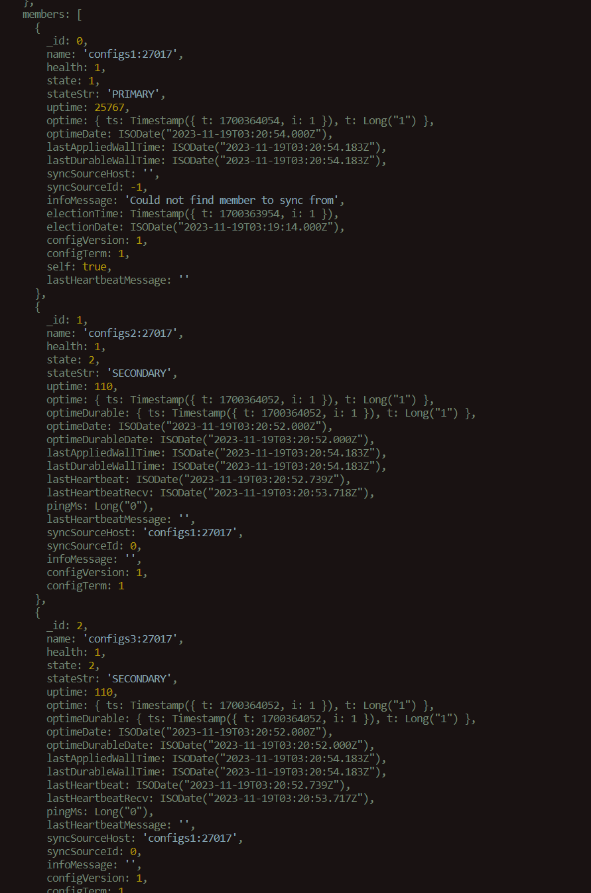
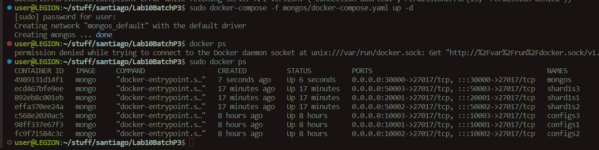

##  Observaciones:

Al crear las replicas en mongo, se deben  de especificar como direcciones a los nombres de los pods containers creados. 

rs.initiate({
  _id: "cfgrs",
  configsvr: true,
  members: [
    { _id : 0, host : "configs1:27017" },
    { _id : 1, host : "configs2:27017" },
    { _id : 2, host : "configs3:27017" }
  ]
})

In this command, the host values are set to the names of the MongoDB services in your Docker Compose file, followed by the port number. This is because Docker Compose creates a default network where each service can be accessed by other services using the service name as the hostname.

2. Notar que en la configuracion de las instancias de replicas, se utiliza el param `shardsvr`, el cual indica que la instancia mongo en cuestion es un shard


El `docker-compose.yaml` para las shards deberia ser el siguiente:

```yaml
version: '3'
services:
  shard1s1:
    container_name: shard1s1
    image: mongo
    command: mongod --shardsvr --replSet shard1rs --port 27017 --dbpath /data/db
    ports:
      - 20001:27017
    volumes:
      - shard1s1:/data/db
  shard1s2:
    container_name: shard1s2
    image: mongo
    command: mongod --shardsvr --replSet shard1rs --port 27017 --dbpath /data/db
    ports:
      - 20002:27017
    volumes:
      - shard1s2:/data/db
  shard1s3:
    container_name: shard1s3
    image: mongo
    command: mongod --shardsvr --replSet shard1rs --port 27017 --dbpath /data/db
    ports:
      - 20003:27017
    volumes:
      - shard1s3:/data/db
volumes:
  shard1s1: {}
  shard1s2: {}
  shard1s3: {}
```

## Resultados:





Repo:

[repo of batch job](https:github.com/loaspra/lab-sw2-sharding)


## Requirements:

- Scala y Maven

```bash
sudo apt install scala -y

sudo apt install maven -y
```

- Spark

```bash 
wget https://downloads.apache.org/spark/spark-3.5.0/spark-3.5.0-bin-hadoop3.tgz
tar xvf spark-3.5.0-bin-hadoop3.tgz

sudo mv spark-3.5.0-bin-hadoop3 /opt/spark

echo 'export SPARK_HOME=/opt/spark' >> ~/.bashrc
echo 'export PATH=$PATH:$SPARK_HOME/bin:$SPARK_HOME/sbin' >> ~/.bashrc
source ~/.bashrc

# Check
spark-submit --version
```

- MongoDB Connector para Spark

> Se agrega al pom.xml la dependencia

```xml
<dependency>
  <groupId>org.mongodb.spark</groupId>
  <artifactId>mongo-spark-connector_2.12</artifactId>
  <version>3.0.1</version>
</dependency>
```

El batch job se compila usando **maven**, luego de haberse creado el target, se corre en un container usando el dockerFile en cuestion